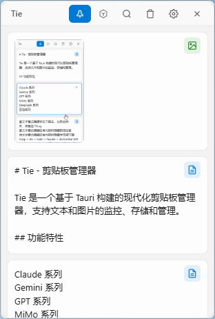

# Tie - 剪贴板管理器

Tie 是一个基于 Tauri 构建的现代化剪贴板管理器，支持文本和图片的监控、存储和管理。



## 功能特性

### 核心功能
- **剪贴板监控** - 自动监控并记录剪贴板内容（文本和图片）
- **历史记录** - 保存最多 200 条剪贴板历史记录
- **快速粘贴** - 点击即可将内容粘贴到目标应用
- **常用语管理** - 添加、删除快捷常用语

### 系统集成
- **系统托盘** - 最小化到托盘运行，左键单击显示窗口，双击快速粘贴图片
- **全局快捷键** - `Super+V` (Windows) 快速唤醒剪贴板窗口
- **开机自启** - 支持系统启动时自动运行
- **窗口置顶** - 可选的窗口置顶功能

### 数据管理
- **本地备份** - 自动备份文本内容到本地文件
- **图片保存** - 自动将图片保存到指定文件夹
- **配置持久化** - 记住窗口位置和各种设置

### 自定义设置
- **窗口透明度** - 可调节的窗口不透明度
- **工具栏按钮** - 可自定义显示/隐藏各个工具栏按钮
- **关闭行为** - 可选择关闭时后台运行或退出应用
- **位置固定** - 可固定快捷键和托盘唤起时的窗口位置

## 技术栈

- **前端**: Vue 3 + TypeScript + Vite
- **后端**: Tauri 2 (Rust)
- **插件**:
  - tauri-plugin-dialog - 文件夹选择对话框
  - tauri-plugin-store - 配置数据持久化
  - tauri-plugin-global-shortcut - 全局快捷键
  - tauri-plugin-autostart - 开机自启动

## 开发环境

### 依赖要求
- Node.js >= 18
- Rust >= 1.70
- pnpm (推荐) 或 npm

### 安装依赖

```bash
pnpm install
```

### 开发模式

```bash
pnpm tauri dev
```

### 构建发布

```bash
pnpm tauri build
```

## 项目结构

```
├── src/                      # Vue 前端源码
│   ├── App.vue              # 主应用组件
│   ├── main.ts              # 前端入口
│   └── vite-env.d.ts        # Vite 类型定义
├── src-tauri/               # Tauri/Rust 后端源码
│   ├── src/
│   │   ├── main.rs          # Rust 主入口
│   │   ├── lib.rs           # Tauri 应用配置和命令
│   │   └── clipboard.rs     # 剪贴板监控和操作
│   ├── Cargo.toml           # Rust 依赖配置
│   └── capabilities/        # Tauri 权限配置
├── package.json             # 前端依赖配置
└── vite.config.ts           # Vite 构建配置
```

## 使用说明

### 快捷键
- `Super+V` - 全局唤醒剪贴板窗口（显示在光标位置附近）

### 托盘操作
- **左键单击** - 显示主窗口
- **左键双击** - 快速粘贴图片
- **右键菜单** - 显示窗口 / 退出应用

### 工具栏按钮
- **置顶** - 切换窗口置顶状态
- **常用语** - 切换常用语面板
- **搜索** - 显示/隐藏搜索框
- **清空** - 清空所有剪贴板历史
- **设置** - 打开设置面板
- **关闭** - 关闭主窗口

## 配置存储

配置文件位于应用数据目录：
- Windows: `%APPDATA%\com.tauri.dev\Tie\`
- macOS: `~/Library/Application Support/com.tauri.dev.Tie/`

主要配置文件：
- `config.json` - 应用设置和常用语
- `clipboard.json` - 剪贴板历史记录

## License

MIT
